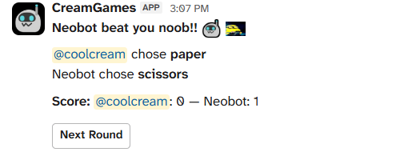
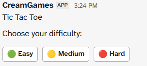

# Cream Games!!
Hello people!!! Welcome to cream games! My first slack bot made using slack bolt and type-script! With this, you can play games with the bot to pass time!!


## Games made until now
- Tic-Tac-Toe (Easy)
- Tic-Tac-Toe (Meduim)
- Tic-Tac-Toe (Impossible)
- Rock Paper Scissors

## Upcoming games:
- Connect 4
- Coin Flip
- Idk more (give me ideas)

## Stack used
- Node
- Typescript
- Slack Bolt (Library)

## Commands to try out
- `/cream-games` - Lists out the games available
- `/cream-games tictactoe` - Starts a tic-tac-toe game
- `/cream-games rps` - Starts a rock paper scissors game, first to 3 wins!

## How to set up locally:
1. Create a slack bot on https://api.slack.com wih socket mode turned on.
2. Clone this repository locally `git clone https://Sankarshan-T/creams-games`
3. Create a .env file with all required keys.
```
.env:
SLACK_SIGNING_SECRET=...
SLACK_BOT_TOKEN=xoxb-.....-.....-.....
SLACK_APP_TOKEN=xapp-.-....-.....-.... 
```
4. Install all dependencies on the root directory with `npm install`
5. Once everythings installed, run the bot using `npm run dev`!!
6. If you did everything right, you will see something like `Yooo cream games is atually running!!`  on the console!

## AI usage
I used chatGPT to get familiar with the slack bolt library (cuz it my first slackbot), but rest all was done by me (I love type-script!!)

## Gallery:

